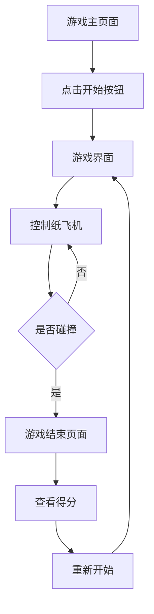

## 1. 产品概述
折纸风格横板飞机游戏，玩家控制纸飞机躲避从右侧飞来的敌人，体验紧张刺激的飞行挑战。
- 面向休闲游戏玩家，提供简单易上手但富有挑战性的游戏体验
- 通过独特的折纸艺术风格，创造视觉上的差异化和吸引力

## 2. 核心功能

### 2.1 用户角色
| 角色 | 注册方式 | 核心权限 |
|------|---------------------|------------------|
| 玩家 | 无需注册 | 直接进入游戏，控制纸飞机进行游戏 |

### 2.2 功能模块
1. **游戏主页面**：游戏标题、开始按钮、游戏规则说明
2. **游戏界面**：纸飞机控制、敌人生成、碰撞检测、得分显示
3. **游戏结束页面**：得分展示、重新开始按钮

### 2.3 页面详情
| 页面名称 | 模块名称 | 功能描述 |
|-----------|-------------|---------------------|
| 游戏主页面 | 标题区域 | 显示游戏名称和折纸风格的视觉元素 |
| 游戏主页面 | 开始按钮 | 点击进入游戏界面 |
| 游戏主页面 | 规则说明 | 简要介绍游戏玩法和操作方式 |
| 游戏界面 | 纸飞机控制 | 通过鼠标或键盘控制纸飞机上下移动 |
| 游戏界面 | 敌人系统 | 从右侧生成不同类型的折纸风格敌人 |
| 游戏界面 | 碰撞检测 | 检测纸飞机与敌人的碰撞，触发游戏结束 |
| 游戏界面 | 得分系统 | 记录游戏时间和得分 |
| 游戏结束页面 | 得分展示 | 显示最终得分和游戏时间 |
| 游戏结束页面 | 重新开始 | 点击重新开始游戏 |

## 3. 核心流程
玩家进入游戏主页面 → 点击开始按钮 → 进入游戏界面控制纸飞机躲避敌人 → 碰撞后进入游戏结束页面 → 查看得分并选择重新开始

## 4. 用户界面设计
### 4.1 设计风格
- 主色调：白色（纸张）、红色（尾烟）、蓝色（天空背景）
- 按钮风格：折纸风格，带有明显的折痕效果
- 字体：简洁的无衬线字体，如Arial或Helvetica
- 布局风格：横板卷轴式，从左向右移动
- 图标/表情风格：折纸风格，使用简单的几何形状构成

### 4.2 页面设计概览
| 页面名称 | 模块名称 | UI元素 |
|-----------|-------------|-------------|
| 游戏主页面 | 标题区域 | 大标题使用折纸风格字体，背景为浅蓝色天空，点缀白色云朵 |
| 游戏主页面 | 开始按钮 | 折纸风格按钮，悬停时有轻微的动画效果 |
| 游戏界面 | 纸飞机 | 白色折纸飞机，带有红色尾烟效果，飞行时晃晃悠悠 |
| 游戏界面 | 敌人 | 不同形状的折纸敌人，颜色各异，飞行轨迹不同 |
| 游戏界面 | 背景 | 浅蓝色天空，带有白色云朵，随游戏进程缓慢移动 |
| 游戏结束页面 | 得分展示 | 大字体显示得分，背景为半透明的黑色覆盖 |
| 游戏结束页面 | 重新开始按钮 | 折纸风格按钮，与主页面保持一致的设计 |

### 4.3 响应式设计
- 桌面优先设计，支持鼠标和键盘操作
- 移动设备适配，支持触摸操作
- 自动调整游戏区域大小，确保在不同屏幕尺寸下都能完整显示

### 4.4 3D场景指导（不适用）
- 本游戏为2D横板游戏，不涉及3D场景