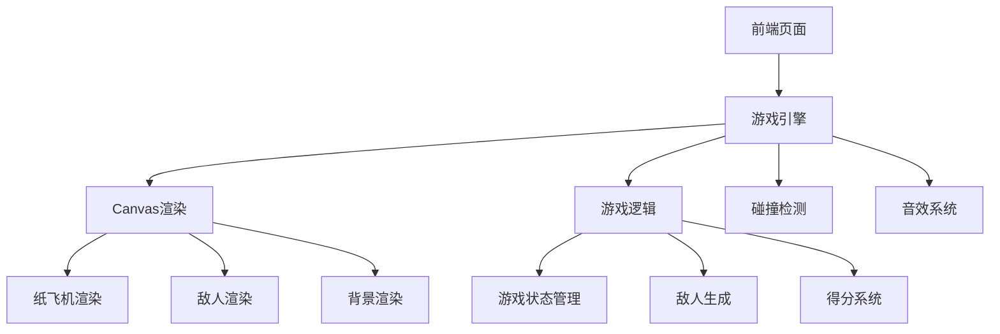

## 1. 架构设计


## 2. 技术描述
- 前端：HTML5 + Canvas + JavaScript
- 游戏引擎：自定义游戏引擎（基于Canvas API）
- 渲染技术：矢量图形渲染（Canvas 2D API）
- 动画：requestAnimationFrame
- 碰撞检测：轴对齐 bounding box (AABB) 算法
- 音效：Web Audio API（可选）

## 3. 路由定义
| 路由 | 用途 |
|-------|---------|
| / | 游戏主页面 |
| /game | 游戏界面 |
| /gameover | 游戏结束页面 |

## 4. API定义（不适用）
- 本游戏为纯前端游戏，不涉及后端API调用

## 5. 服务器架构图（不适用）
- 本游戏为纯前端游戏，不涉及服务器架构

## 6. 数据模型（不适用）
- 本游戏为纯前端游戏，不涉及数据库存储

## 7. 技术实现细节
### 7.1 游戏引擎核心模块
- **游戏循环**：使用requestAnimationFrame实现游戏主循环
- **渲染系统**：基于Canvas 2D API的矢量图形渲染
- **输入系统**：处理鼠标、键盘和触摸输入
- **碰撞检测**：实现AABB碰撞检测算法
- **实体系统**：管理游戏中的所有实体（纸飞机、敌人、尾烟等）

### 7.2 纸飞机实现
- 使用Canvas 2D API绘制折纸风格的飞机
- 实现晃晃悠悠的飞行姿态（使用正弦函数模拟）
- 红色尾烟效果（使用粒子系统实现）

### 7.3 敌人实现
- 不同类型的敌人（直线飞行、追踪飞行等）
- 折纸风格的敌人设计
- 随机生成敌人的位置和类型

### 7.4 游戏逻辑
- 得分系统：基于游戏时间和躲避的敌人数量
- 游戏状态管理：主菜单、游戏中、游戏结束
- 难度递增：随着游戏进行，敌人数量和速度增加

### 7.5 性能优化
- 使用requestAnimationFrame进行高效渲染
- 减少Canvas绘制操作，优化渲染性能
- 合理管理游戏实体，避免内存泄漏

### 7.6 响应式设计
- 自适应不同屏幕尺寸
- 针对移动设备优化触摸控制
- 保持游戏体验的一致性

## 8. 文件结构
```
/
├── index.html              # 游戏主页面
├── game.html               # 游戏界面
├── gameover.html           # 游戏结束页面
├── css/
│   └── style.css           # 样式文件
├── js/
│   ├── game-engine.js      # 游戏引擎核心
│   ├── paper-plane.js      # 纸飞机类
│   ├── enemy.js            # 敌人基类
│   ├── enemies/
│   │   ├── straight.js     # 直线飞行敌人
│   │   └── tracker.js      # 追踪敌人
│   ├── particle.js         # 粒子系统（尾烟效果）
│   ├── collision.js        # 碰撞检测
│   ├── game-state.js       # 游戏状态管理
│   └── main.js             # 游戏入口
└── assets/
    └── sounds/             # 音效文件（可选）
```